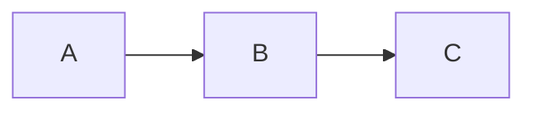
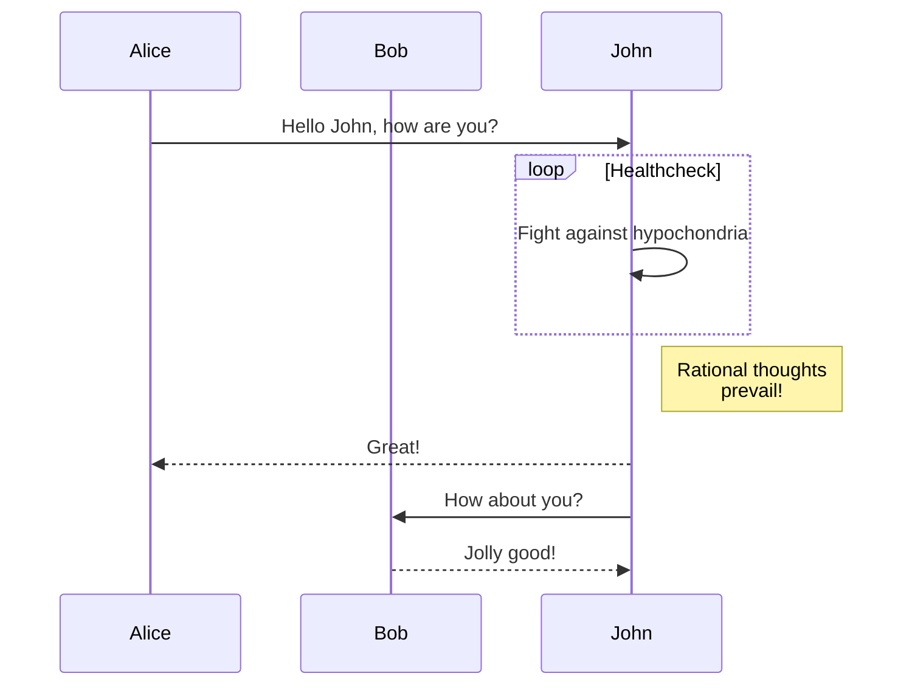

---

This page stands as an example of supported Markdown-to-HTML processing. More is available, see respective documentation.

# Blockquotes

```markdown
> Un bon croquis vaut mieux qu'un long discours.
```

> Un bon croquis vaut mieux qu'un long discours.

# Emphasis

## General

```markdown
*This text should be italic.* _This should also be italic._

**This text should be bold.** __This should also be bold.__

^^This text should be underlined.^^

~~This text should be crossed out.~~

_One **can** ^^combine^^ all ~~those~~._
```

*This text should be italic.* _This should also be italic._

**This text should be bold.** __This should also be bold.__

^^This text should be underlined.^^

~~This text should be crossed out.~~

_One **can** ^^combine^^ all ~~those~~._

## Sub-/super-script

```markdown
H~2~O

Copyright^©^
```

H~2~O

Copyright^©^

# Equations

Rendered in the browser via [KaTeX](https://katex.org/). `$$` and `$` notations are supported.

## Block

```markdown
$$E = m \, c^{2}$$

$$f(x) = \int_{-\infty}^{\infty} \hat{f}(\xi) \, e^{2 \pi i \xi x} \, d\xi$$
```

$$E = m \, c^{2}$$

$$f(x) = \int_{-\infty}^{\infty} \hat{f}(\xi) \, e^{2 \pi i \xi x} \, d\xi$$

## Inline

```markdown
And here is an inline equation: $2 \pi i \xi x$.
```

And here is an inline equation: $2 \pi i \xi x$.

# Images

Hijacked and rendered via [`markdown-img`](https://github.com/carnarez/markdown-img).

```markdown

```


# Inline code

```markdown
Inline code blocks such as `import polars as pl` are not highlighted.
```

Inline code blocks such as `import polars as pl` are not highlighted.

# Links

```markdown
[My GitHub](https://github.com/carnarez)
```

[My GitHub](https://github.com/carnarez)

# Lists

## Unordered list

```markdown
* Item
* Item
    * Subitem
    * Subitem
```

* Item
* Item
    * Subitem
    * Subitem

## Ordered list

```markdown
1. Item 1
1. Item 2
    1. Item 2a
    1. Item 2b
```

1. Item 1
1. Item 2
    1. Item 2a
    1. Item 2b

# Markdown in HTML

```markdown
<details markdown="1">
<summary>Test</summary>

**This is bold**, ^^this is underlined^^.

</details>
```

<details markdown="1">
<summary>Test</summary>

**This is bold**, ^^this is underlined^^.

</details>

# Mermaid diagram

Rendered in the browser via [Mermaid](https://mermaidjs.github.io/).

````markdown

````


And a more complicated one from the official website:



Check [this page](https://mermaid-js.github.io/mermaid/#/theming) to style diagrams.

# Scripts

Rendered via [`markdown-script`](https://github.com/carnarez/markdown-script).

```markdown
%[Some JavaScript](/wherever/script.js)
```

%[Some JavaScript](/wherever/script.js)

# Syntax highlighting

Rendered in the browser via [`highlight.js`](https://highlightjs.org/).

````markdown
```python
import polars as pl
```
````

```python
import polars as pl

q = (
    pl.scan_csv("iris.csv")
    .filter(pl.col("sepal_length") > 5)
    .groupby("species")
    .agg(pl.all().sum())
)

df = q.collect()
```

# Tables

```markdown
First Header | Second Header
------------ | -------------
Content from cell 1 | Content from cell 2
Content in the first column | Content in the second column
$2 \pi r^{2}$ | With inline equation
```

First Header | Second Header
------------ | -------------
Content from cell 1 | Content from cell 2
Content in the first column | Content in the second column
$2 \pi r^{2}$ | With inline equation

# Title

Using the `#` to `######` notation.

## Subtitle

Text

### Section

Text

#### Subsection

Text

##### Paragraph

Text

###### Subparagraph

Text

---
