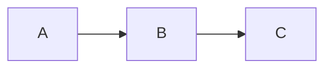

[TOC]

This page stands as an example of supported Markdown-to-HTML processing. Plenty more details and variants available, check respective documentation.

# Astdocs

Files including [`astdocs`](https://github.com/carnarez/markdown-insert) `%%%` markers are parsed and rendered via the [`markdown-astdocs`](https://github.com/carnarez/markdown-astdocs) extension.

# Blockquote

Napoleon alledgedly said:

```markdown
> Un bon croquis vaut mieux qu'un long discours.
```

> Un bon croquis vaut mieux qu'un long discours.

# Emphasis

## General

```markdown
*This text should be italic.* _This should also be italic._

**This text should be bold.** __This should also be bold.__

_One **can** ^^combine^^ all ~~them~~ emphases._
```

*This text should be italic.* _This should also be italic._

**This text should be bold.** __This should also be bold.__

_One **can** ^^combine^^ all ~~them~~ emphases._

## Sub-/super-script

Rendered via the [`caret`](https://facelessuser.github.io/pymdown-extensions/extensions/caret/) and [`tilde`](https://facelessuser.github.io/pymdown-extensions/extensions/tilde/) extensions.

```markdown
^^This text should be underlined.^^

Copyright^©^

~~This text should be crossed out.~~

H~2~O
```

^^This text should be underlined.^^

Copyright^©^

~~This text should be crossed out.~~

H~2~O

# Emoji

Rendered via the [`emoji`](https://python-markdown.github.io/extensions/emoji/) extension.

```markdown
:wink: :fish: :scream:
```

:wink: :fish: :scream:

See [this file](https://github.com/ikatyang/emoji-cheat-sheet/blob/master/README.md) for
a complete list of available emojis.

# Equation

Rendered in the browser via [`KaTeX`](https://katex.org/). `$$` and `$` notations are supported.

## Block

```latex
$$E = m \, c^{2}$$

$$
\begin{aligned}
3x^{2} + 9y &= 3i - 6z \\\\
3(x^{2} + 3y) &= 3(i - 2z) \\\\
x^{2} + 3y &= i - 2z
\end{aligned}
$$

$$f(x) = \int_{-\infty}^{+\infty} \hat{f}(\xi) \, e^{2 \pi i \xi x} \, d\xi$$
```

Note the `\\\\` for a new line instead of the regular `\\` (`html-minifier` mangles double to single).

$$E = m \, c^{2}$$

$$
\begin{aligned}
3x^{2} + 9y &= 3i - 6z \\\\
3(x^{2} + 3y) &= 3(i - 2z) \\\\
x^{2} + 3y &= i - 2z
\end{aligned}
$$

$$f(x) = \int_{-\infty}^{+\infty} \hat{f}(\xi) \, e^{2 \pi i \xi x} \, d\xi$$

## Inline

```markdown
And here is an inline equation: $2 \pi i \xi x$.
```

And here is an inline equation: $2 \pi i \xi x$.

# Footnote

Rendered via the `footnotes` extension.[^1]

[^1]: See [this link](https://python-markdown.github.io/extensions/footnotes/).

```markdown
Napoleon alledgedly said:[^2]

[^2]: Footnote content (_including_ Markdown).

> Un bon croquis vaut mieux qu'un long discours.
```

Napoleon alledgedly said:[^2]

[^2]: I [did not invent it](https://en.wikipedia.org/wiki/A_picture_is_worth_a_thousand_words#Equivalents).

> Un bon croquis vaut mieux qu'un long discours.

<details markdown="1">
<summary markdown="1">Manually check footnote numbering</summary>

The extension is ~~not smart~~ what it is and one has to keep track of footnote numbering. A quick check could look like follows:

```python
# python check_footnotes.py <FILE>

import re
import sys

markers = {}

# read the file
with open(sys.argv[1]) as f:
    text = f.read()

# find all references in the document
# results stored as lists as we are going to iterate twice over them
as_footnote = list(re.finditer(r"^[\t ]*(\[\^\S+\]):.*", text, flags=re.MULTILINE))
in_document = list(re.finditer(r".+(\[\^\S+\])", text))

for m in as_footnote + in_document:
    if m.group(1) not in markers:
        markers[m.group(1)] = {"defs": [], "refs": []}

# parse references defining footnotes
for m in as_footnote:
    markers[m.group(1)]["defs"].append((text[:m.start()].count("\n") + 1, m.group(0)))

# parse references in text proper
for m in in_document:
    markers[m.group(1)]["refs"].append((text[:m.start()].count("\n") + 1, m.group(0)))

# https://en.wikipedia.org/wiki/ANSI_escape_code#Colors
default = "\033[0m"
gray = "\033[1;30m"
red = "\033[0;31m"

# in red what is never referenced or corresponding to multiple footnotes
for m in markers:
    defs, refs = markers[m]["defs"], markers[m]["refs"]
    color = default if len(defs) == 1 and len(refs) else red

    print(f"{color}{m}{default}")
    for line, text in defs:
        print(f'{color}{" "*4}{text[:50]:50s} {gray}{line:-4d}{default}')
    for line, text in refs:
        print(f'{color}{" "*8}{text[:46]:46s} {gray}{line:-4d}{default}')
```

</details>

# Markdown-in-HTML

Parsed via the [`md_in_html`](https://python-markdown.github.io/extensions/md_in_html/) extension.

HTML is allowed within the document; nested Markown too. Example of the `<details>` and `<summary>` tags:

* Note the `markdown="1"` attribute to make sure the content inside those tags is being parsed
  and converted properly.
* Mind the necessary spaces:
    - After the `<summary>...</summary>` line.
    - Before the closing `</details>` tag.

````markdown
<details markdown="1">
<summary markdown="1">Test with some `code` in the summary text</summary>

**This is bold**, ^^this is underlined^^. [This is a link](https://calmcode.io/).

```python
import polars as pl
```

</details>
````

<details markdown="1">
<summary markdown="1">Test with some `code` in the summary text</summary>

**This is bold**, ^^this is underlined^^. [This is a link](https://calmcode.io/).

```python
import polars as pl
```

</details>

# Image

Hijacked and rendered via the [`markdown-img`](https://github.com/carnarez/markdown-img) extension.

```markdown

```


# Inline code

```markdown
Inline code blocks such as `import polars as pl` are not highlighted.
```

Inline code blocks such as `import polars as pl` are not highlighted.

# Insert

Rendered via the [`markdown-insert`](https://github.com/carnarez/markdown-insert) extension.

```bash
$ cat insert.md
> This is the content of the insert.
```

Syntax is abused from the Markdown link, and works even within code blocks: `&[]()`. For instance `&[](insert.md)` would render:

&[](insert.md)

<details markdown="1">
<summary markdown="1">Fancy scripting with regular expressions</summary>

Note the insert is [also available rendered](insert.html). A couple lines could get rid of the rendered HTML file:

```bash
$ grep -ER '^&\[.*\]\(.+\)\s*$' . | sed -r 's#/[^/]+:&\[.*\]\((.+)\)#/\1#g;s/\.md$/\.html/g' | while read f; do rm $f; done
```

</details>

# Link

```markdown
[GitHub Docs](https://docs.github.com/)
```

[GitHub Docs](https://docs.github.com/)

# List

## Ordered

```markdown
1. Item 1
1. Item 2
    1. Item 2a
    1. Item 2b
```

1. Item 1
1. Item 2
    1. Item 2a
    1. Item 2b

## Unordered

```markdown
* Item
* Item
    * Subitem
    * Subitem
```

* Item
* Item
    * Subitem
    * Subitem

# Mermaid diagram

Picked up by the [`superfences`](https://facelessuser.github.io/pymdown-extensions/extensions/superfences/) extension, and rendered in the browser via [`Mermaid`](https://mermaidjs.github.io/).

````markdown

````


For more examples (taken from the official documentation), see [this test page](/tests/mermaid). Note some adjustements are made to the theme (see the `mermaidInitialize()` function in [this script](https://github.com/carnarez/markdown-tests/blob/master/static/mermaid.js)) to take into account our own colour schemes. Check ~~[this totally obsolete documentation](https://github.com/mermaid-js/mermaid/blob/develop/docs/theming.md)~~ [the variables defined in the theme](https://github.com/mermaid-js/mermaid/blob/develop/src/themes/theme-base.js) to further style diagrams.

# Script

Rendered via the [`markdown-script`](https://github.com/carnarez/markdown-script) extension.

```markdown
%[Chart](chart.js)
```

%[Chart](chart.js)

# Syntax highlighting

Picked up by the [`superfences`](https://facelessuser.github.io/pymdown-extensions/extensions/superfences/) extension, and parsed/rendered in the browser via [`highlight.js`](https://highlightjs.org/).

````markdown
```python
import polars as pl

q = (
    pl.scan_csv("iris.csv")
    .filter(pl.col("sepal_length") > 5)
    .groupby("species")
    .agg(pl.all().sum())
)

df = q.collect()
```
````

```python
import polars as pl

q = (
    pl.scan_csv("iris.csv")
    .filter(pl.col("sepal_length") > 5)
    .groupby("species")
    .agg(pl.all().sum())
)

df = q.collect()
```

# Table

Rendered via the [`tables`](https://python-markdown.github.io/extensions/tables/) extension.

```markdown
First Header | Second Header
------------ | -------------
Content from cell 1 | Content from cell 2
Content in the first column | Content in the second column
$2 \pi r^{2}$ | With inline equation
```

First Header | Second Header
------------ | -------------
Content from cell 1 | Content from cell 2
Content in the first column | Content in the second column
$2 \pi r^{2}$ | With inline equation

# Table of Contents

Rendered via the [`toc`](https://python-markdown.github.io/extensions/toc/) extension.

```markdown
[TOC]
```

[TOC]

# Title

Using the `#` to `######` notation. Note that titles can also be immediately followed by
other titles.

```markdown
# Title

Text

## Subtitle

Text

### Section

Text

#### Subsection

Text

##### Paragraph

Text

###### Subparagraph

Text
```

## Subtitle

Text

### Section

Text

#### Subsection

Text

##### Paragraph

Text

###### Subparagraph

Text

```markdown
# Title

## Subtitle

### Section

#### Subsection

##### Paragraph

###### Subparagraph
```

## Subtitle

### Section

#### Subsection

##### Paragraph

###### Subparagraph
