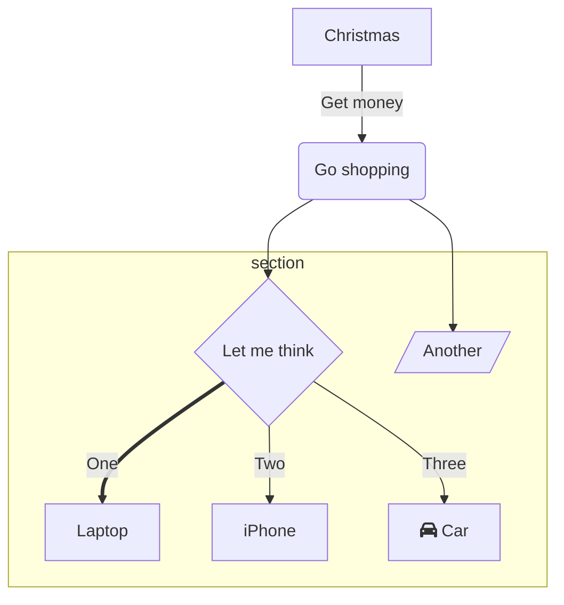
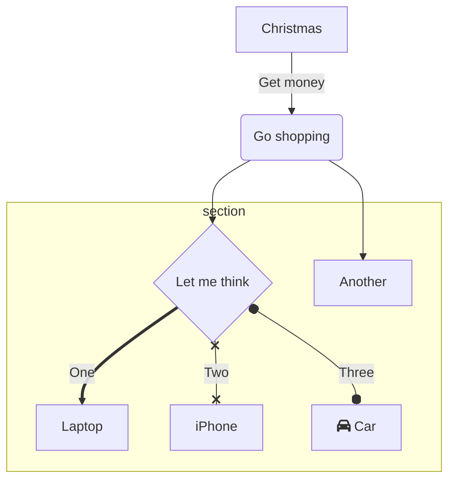
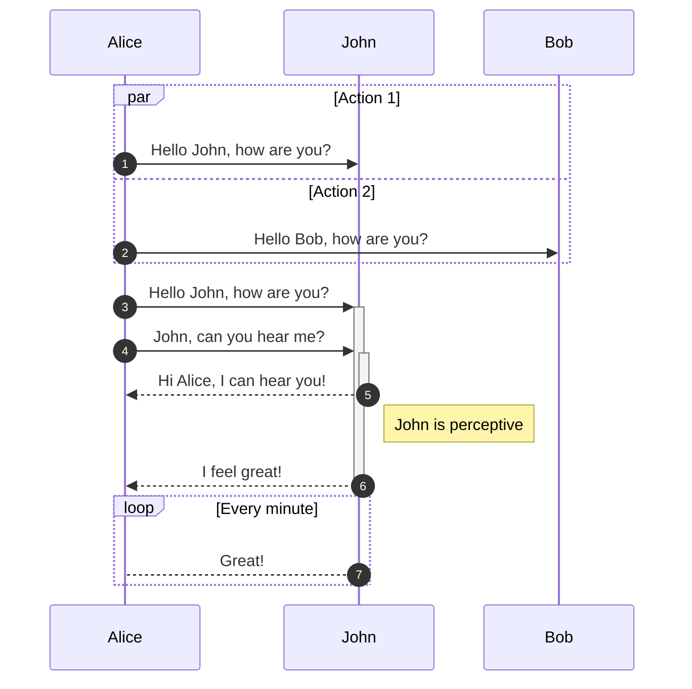
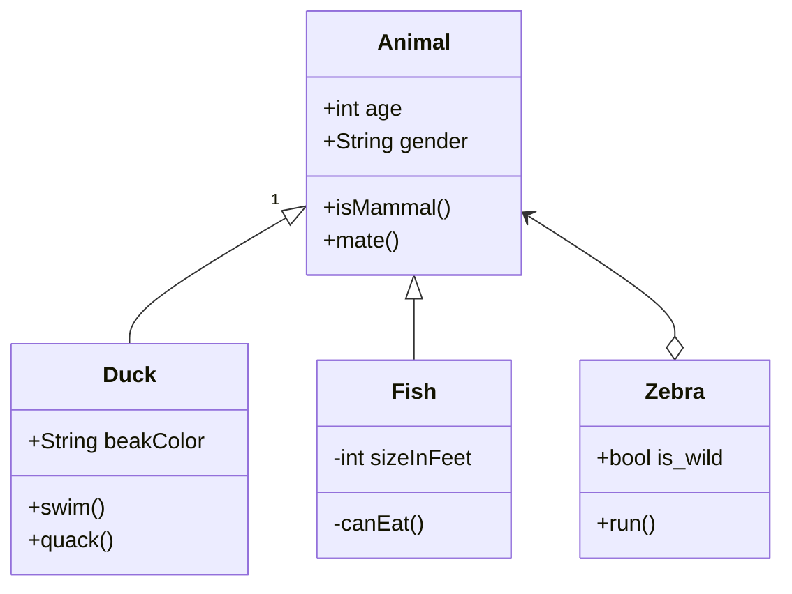
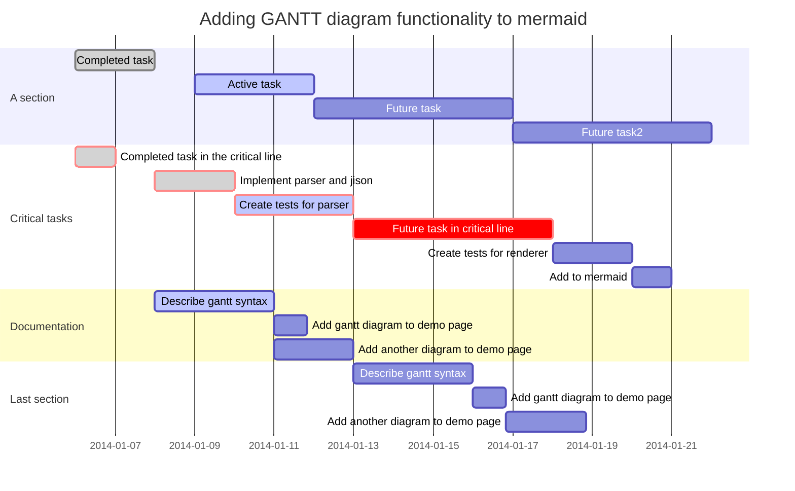
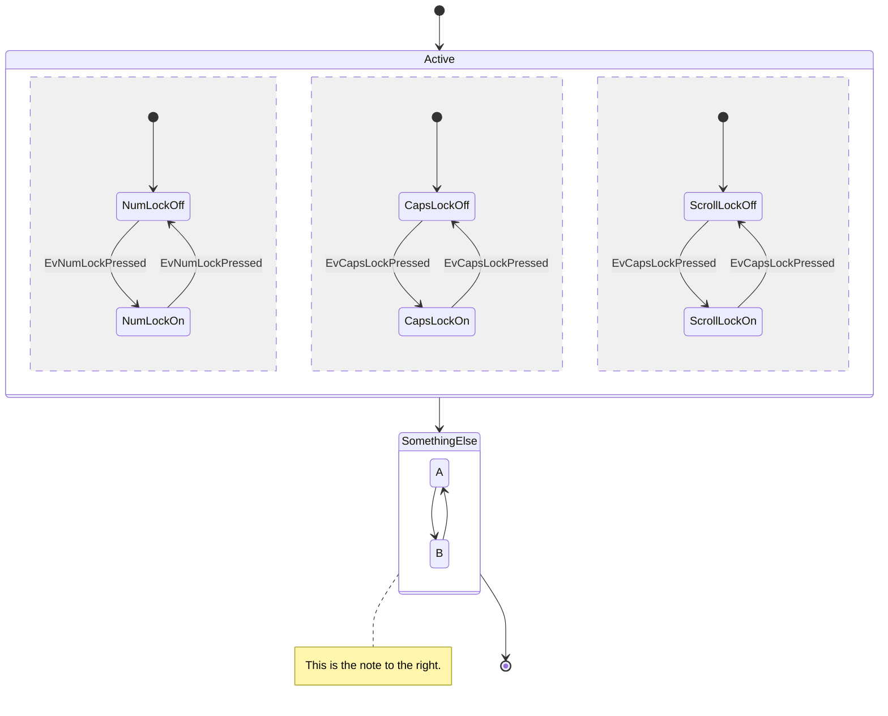
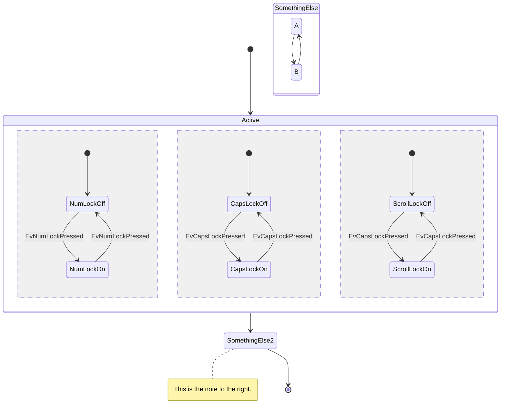
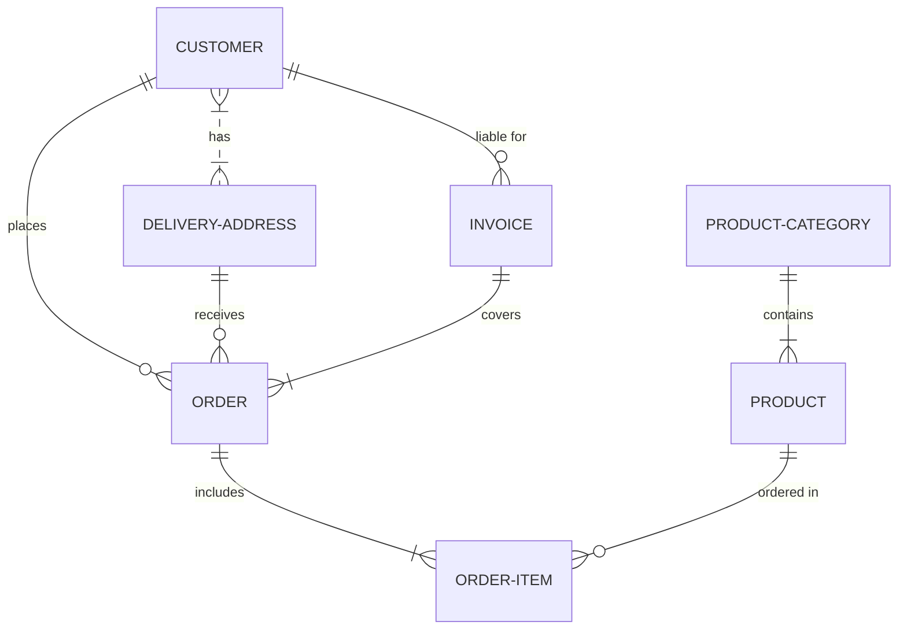
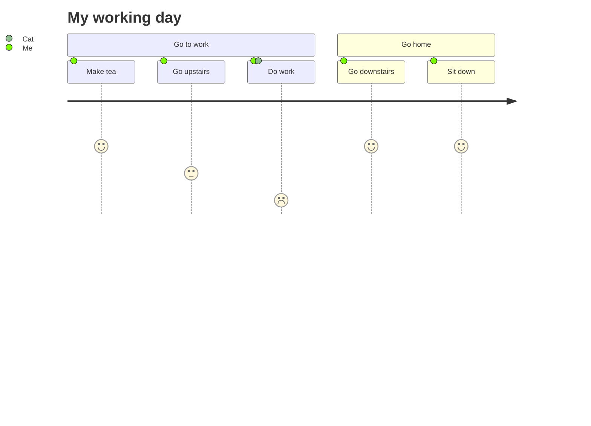

All examples taken from [this page](https://github.com/mermaid-js/mermaid/blob/develop/docs/theming.md).

# Flowchart

# Flowchart (beta)

# Sequence diagram

# Class diagram

# Gantt

# State diagram

# State diagram (beta)

# Entity Relations diagram

# User journey diagram

