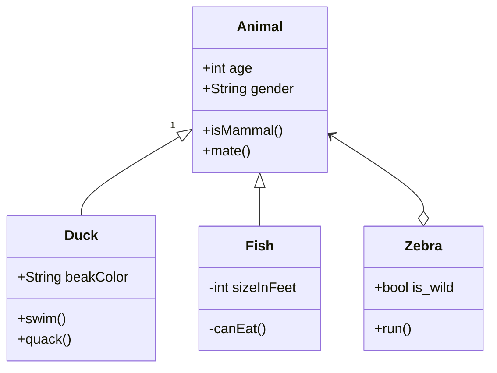
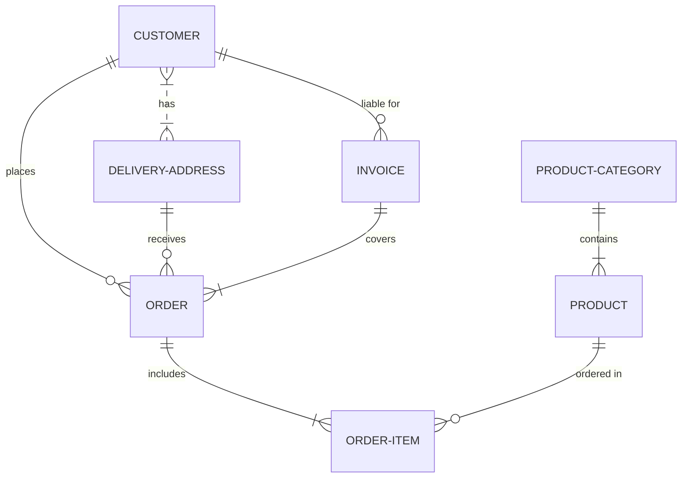
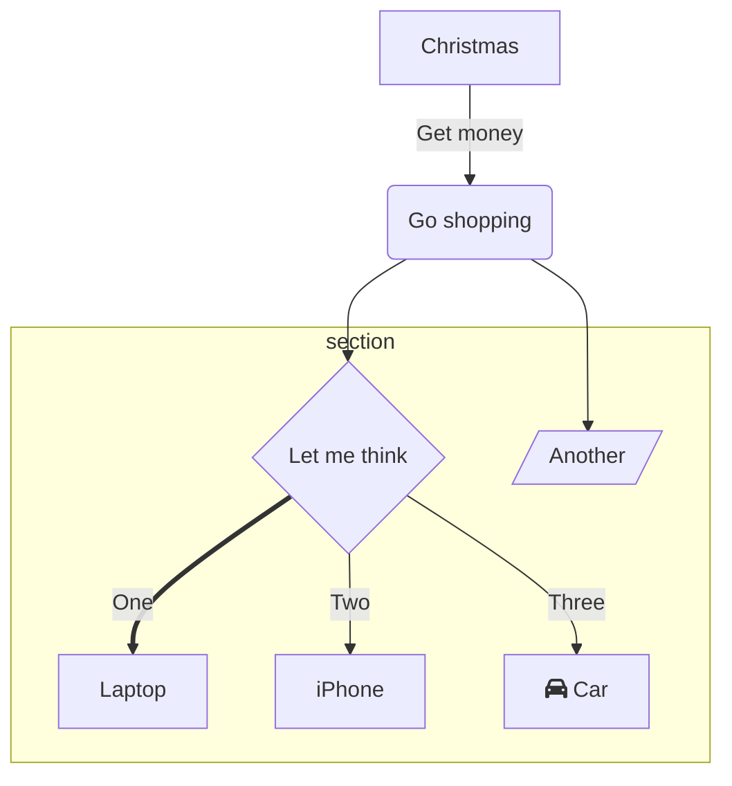
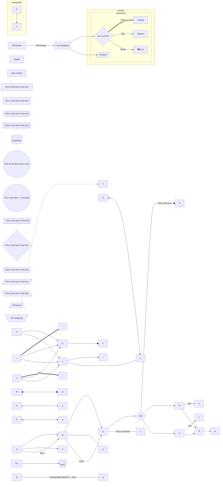
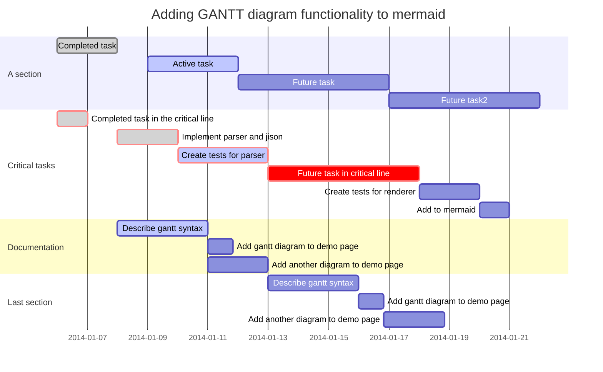
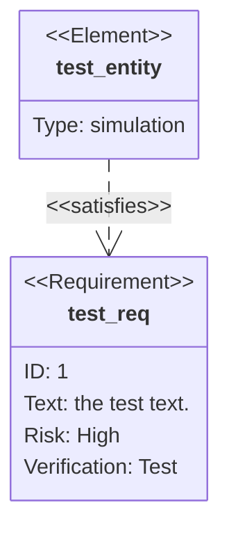
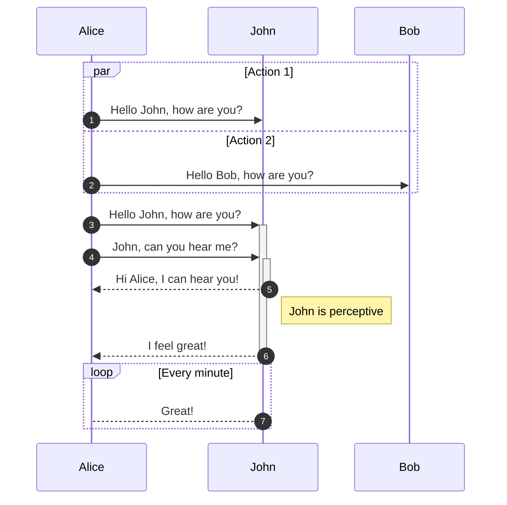
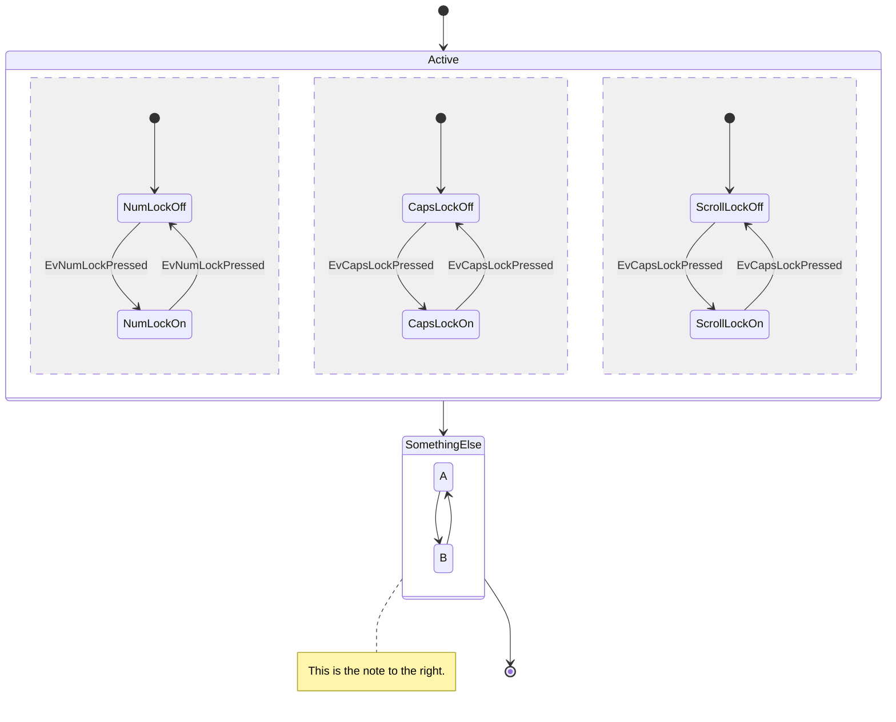
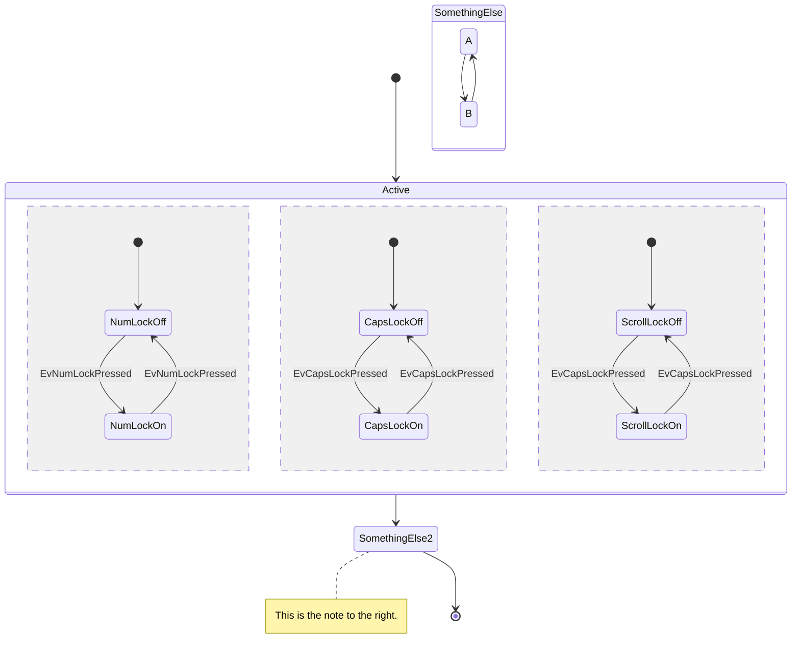
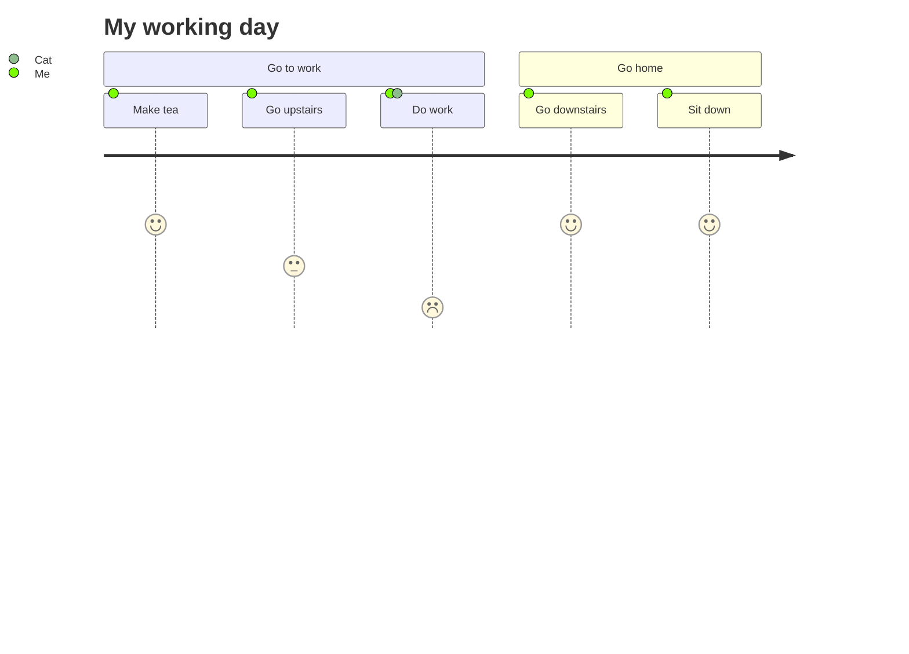

All examples taken from [this page](https://github.com/mermaid-js/mermaid/blob/develop/docs/theming.md).

[TOC]

# Class diagram

# Entity Relations diagram

# Flowchart

# Gantt

# Requirement diagram

# Sequence diagram

# State diagram

# User journey diagram

